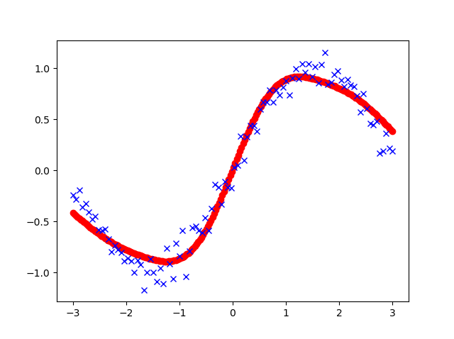

# Radial-Basis-Function-Neural-Network-RBF-
# Introduction:
Radial basis function network is an artificial neural network that uses radial basis functions as activation functions. The output of the network is a linear combination of radial basis functions of the inputs and neuron parameter.


# Code:
I implemneted the RBF for sine function and for training with 200 samples this is the result.



you can run this code with typing 

```python
Python RBF.py
```
